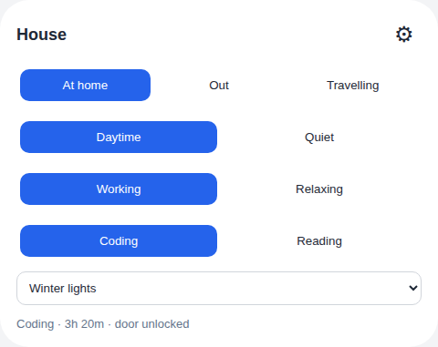

# House State Card

A compact Home Assistant card for the [`house_state`](https://github.com/mvheimburg/house-state) integration. It renders any configured state tree, manages independent overlays, and exposes the integration's runtime settings.



Example with a custom state tree in Bubble appearance.

## Install

Add this repository to HACS as a **Dashboard** repository, install it, and refresh the browser. For manual installation, copy `dist/lovelace-house-state-card.js` to `www/` and register it as a JavaScript module resource.

## Configuration

```yaml
type: custom:lovelace-house-state-card
entity: sensor.house_state
name: Huset
appearance: bubble # default or bubble
show_overlay: true
confirm_vacation: true
```

All card options are available in the visual editor. The integration starts with a Home/Day/Activity example, but none of those names or levels are special. In the settings dialog you can add roots or children, rename and reparent states, choose a scene and default child, and say whether each branch means someone is home. Automation roles point arrival, departure, vacation and night behavior at whichever nodes you choose.

Tree changes stay in a local draft until **Save** sends `state_tree`, `roles`, `initial_state`, and `overlays` together. Removing a node removes its descendants after confirmation and clears references to them. The dialog also configures custom overlays, door/gate/person entities, return and away automation, the grace period, and the night schedule. **Apply scene now** calls `house_state.apply_scene` with `force: true` to resynchronize devices.

State changes call `house_state.set` with `{state, reason: user}`. Overlay changes use `{overlay, reason: user}`. The card reads `active_path`, `state_tree`, `overlays`, `overlay_choice`, `overlay_rule`, `overlay_hold_until`, and `config` from the hub sensor.

## Date-driven overlays

Overlays can turn themselves on. Each overlay in the settings dialog has an **Activation** picker: manual only, a calendar entity (with an optional summary match), fixed `MM-DD` dates, an offset window around Easter, or an nth weekday counted within a month or before an anchor date — which is how Advent works, being the fourth Sunday before 25 December rather than a fixed Sunday of December. A rule can be limited to when someone is home, to particular states, and given a priority that decides overlapping windows.

The overlay picker on the card then shows **Automatic** alongside the overlay the rules currently pick. Choosing an overlay by hand, or **Off**, outranks the rules until the start of the next local day, and the status line shows when that hold expires. Choosing **Automatic** hands the axis straight back.

Rules require the integration at 0.2.0 or later; against an older hub the picker behaves exactly as before. Half-finished rules — a calendar row with no entity chosen — are saved as no rule rather than being rejected.

The card and visual editor follow Home Assistant's UI language (`hass.language`, with `hass.locale.language` as a fallback). Bokmål is supported for `nb`, `nb-NO` and the Norwegian aliases `no`/`nn`; case and underscore variants are accepted. Other languages fall back to English. Changing language updates the card without changing service IDs, configuration keys or saved settings.

Unmodified starter names such as Home/Day/Away and Christmas display as Hjemme/Dag/Borte and Jul in Bokmål. Custom state, overlay and card names stay exactly as entered. Name-editing inputs show the stored name, so saving a draft never writes a display translation back to the integration. Integration-provided error details retain their original wording.

Bubble appearance uses the dashboard's `--bubble-*` variables.

## Development

```sh
npm ci
npm test
npm run lint
npm run typecheck
npm run build
```

Version 0.2.1.
