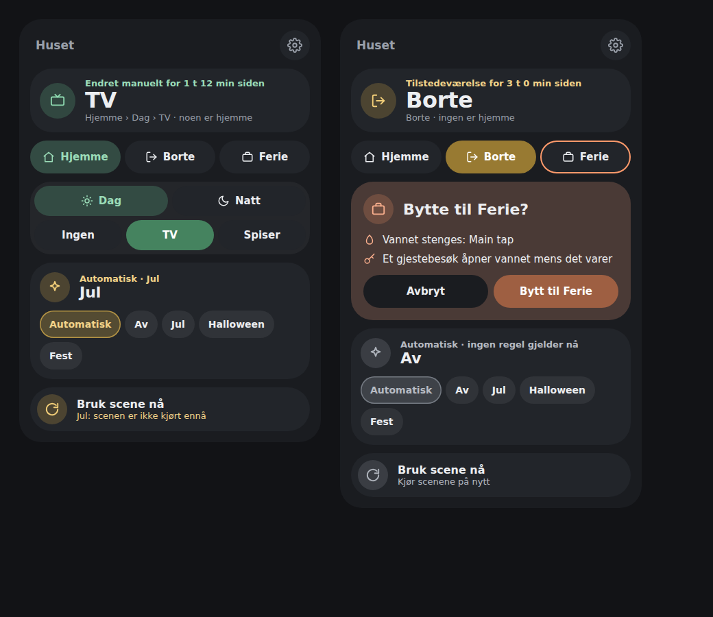
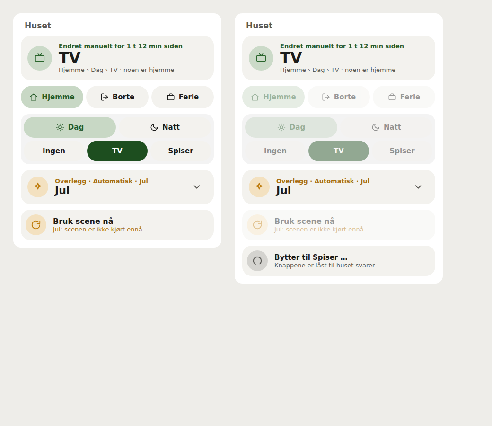
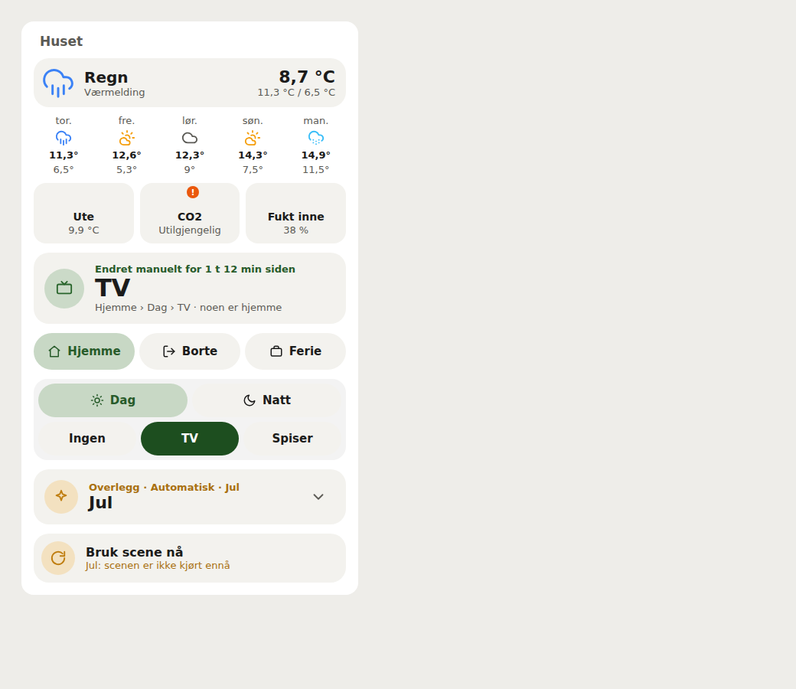
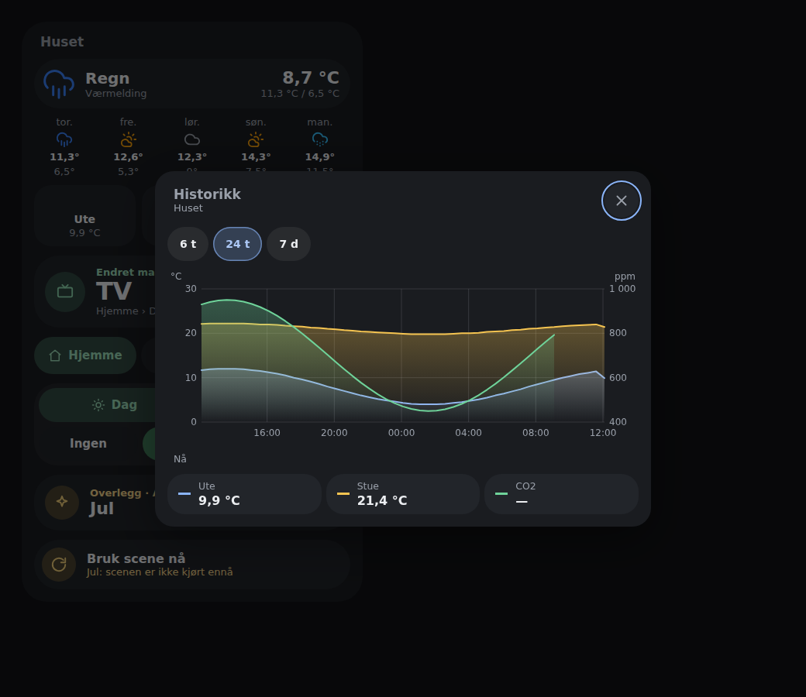

# House State Card

A compact Home Assistant card for the [`house_state`](https://github.com/mvheimburg/house-state) integration. It renders any configured state tree, selects independent overlays, and keeps everyday controls on the dashboard.





The images use the production bundle with simulated Home Assistant states.

## Install

Add this repository to HACS as a **Dashboard** repository, install it, and refresh the browser. For manual installation, copy `dist/lovelace-house-state-card.js` to `www/` and register it as a JavaScript module resource.

## Configuration

```yaml
type: custom:lovelace-house-state-card
entity: sensor.house_state
name: Huset
appearance: bubble # default or bubble
show_overlay: true
confirm_vacation: true
show_settings: false # the settings cog in the header
weather: weather.forecast_home # optional
show_forecast: false # the coming days under the weather
sensors: # optional tiles, each opening its history
  - sensor.outdoor_temperature
  - sensor.living_room_co2
history: card # or more-info, or panel (Home Assistant's History page)
```

All card display options are available in the Lovelace visual editor. The integration starts with a Home/Day/Activity example, but none of those names or levels are special.

**House State integration 0.3.0 or later is required for the central configuration flow.** Open **Settings → Devices & services → House State → Configure** to manage the state tree, scenes, default children, occupancy, automation roles, overlays and activation rules, door/gate/person entities, automatic return/away, grace period, night schedule and legacy mirrors through the integration's structured forms. The card's settings cog opens the **House State** configuration panel (integration 0.6.0 or later, administrators), which shows the whole setup at once; otherwise it links to the House State integration page. From 0.7.0 the cog is off by default; turn on **Show settings button** in the card editor to show it. When the card cannot find or read its House State sensor, it shows the cog anyway, so the settings stay reachable.

The dashboard card contains status, state selection, optional overlay selection, vacation confirmation and **Apply scene now**.

### What the card shows (0.4.0)

- **Status first.** The current state in large type with why and when it changed ("Changed manually 1 h 12 min ago"), the path through the tree, whether someone is home, and an active guest visit with its end time. The card's colour follows the house: occupied, away, or in the vacation role's branch.
- **States as pills.** The top level is one row; deeper levels sit together below it. The path in force is tinted and the current state is filled. The integration's starter states (Home, Day, TV, Eating, Night, Away, Vacation) get icons; custom states show their names only.
- **Overlay.** Folded by default into one row: the overlay in force and why (Automatic with the rule that picked it, or chosen manually and until when). Tap it to show one chip per choice (0.4.1).
- **Vacation confirmation inside the card.** Choosing a state in the vacation role's branch opens a panel naming the state and, when water valves are configured, that the water is shut off and that a guest visit opens it again. Nothing is sent until you confirm.
- **Apply scene now** says when the selected scene has not run yet (`scene_stale`) or is waiting to run (`application_pending`).
- **Feedback.** While a request is pending the card says what it is doing and locks its controls; a failure stays visible in the card (and as a Home Assistant notification) with the state that is still selected. A water valve House State could not move is reported. That action calls `house_state.apply_scene` with `force: true` to resynchronize devices. The card no longer edits integration configuration or calls `house_state.set_config`. During an integration reload it retains the last valid display with actions disabled; refreshed sensor data restores the controls. State, overlay and scene actions are also disabled while a request is pending.

### Weather and sensors at the top (0.7.0)



Both parts are optional and set in the card editor; without them the card looks as before.

- **Weather.** Pick any `weather.*` entity. The card shows the condition, the entity's name, the current temperature and today's high and low. Tap it for Home Assistant's weather details. **Show forecast** (off by default) adds the coming five days with their condition, high and low. The forecast comes from Home Assistant's forecast subscription, so it works with any weather integration that offers a daily or a day-and-night forecast; without one, the high and low are left out.
- **Sensors.** Pick any sensors, such as the outdoor temperature, CO₂ or indoor humidity. Each is a tile with its icon, name and value as Home Assistant formats it; an unavailable sensor is marked.
- **History.** A measured sensor tile opens a history in the card's own style: the tapped reading together with the card's other sensors in its unit, and those in one more unit on a right-hand scale (a third unit is left out). Choose 6 h, 24 h or 7 d, read every value under the pointer, and tap a legend entry for its details. Spells when a sensor was unavailable are gaps. A tile that is not a measurement (a text or timestamp sensor) opens Home Assistant's details instead, since a line adds nothing there.

- **History view** (0.8.0): where a sensor tile opens its history. **In the card**
  (default) is the chart above, now with a translucent fill under each line;
  **Home Assistant's details** opens the standard more-info dialog with its own
  graph; **Home Assistant's History page** opens `/history` with the tapped sensor
  and its related readings over the last 24 hours. The history view is shared
  with our other cards through
  [lovelace-card-history](https://github.com/mvheimburg/lovelace-card-history),
  which this card bundles; in the dialog, **Try again** reloads after a failure,
  and closing it returns focus to the tile you tapped.



State changes call `house_state.set` with `{state, reason: user}`. Overlay changes use `{overlay, reason: user}`. The card reads `active_path`, `state_tree`, `overlays`, `overlay_choice`, `overlay_rule`, `overlay_hold_until`, and `config` from the hub sensor.

## Date-driven overlays

Overlays can turn themselves on. In the integration’s **Configure** flow, each overlay has activation settings: manual only, a calendar entity (with an optional summary match), fixed `MM-DD` dates, an offset window around Easter, or an nth weekday counted within a month or before an anchor date — which is how Advent works, being the fourth Sunday before 25 December rather than a fixed Sunday of December. A rule can be limited to when someone is home, to particular states, and given a priority that decides overlapping windows.

The overlay picker on the card then shows **Automatic** alongside the overlay the rules currently pick. Choosing an overlay by hand, or **Off**, outranks the rules until the start of the next local day, and the status line shows when that hold expires. Choosing **Automatic** hands the axis straight back.

The card displays and selects the configured overlays; activation rules are edited centrally in the integration.

The card and visual editor follow Home Assistant's UI language (`hass.language`, with `hass.locale.language` as a fallback). Bokmål is supported for `nb`, `nb-NO` and the Norwegian aliases `no`/`nn`; case and underscore variants are accepted. Other languages fall back to English. Changing language updates the card without changing service IDs, configuration keys or saved settings.

Unmodified starter names such as Home/Day/Away and Christmas display as Hjemme/Dag/Borte and Jul in Bokmål. Custom state, overlay and card names stay exactly as entered. Integration-provided error details retain their original wording. Regional clock formats such as `en-GB` are preserved separately from the English/Bokmål label dictionaries.

Bubble appearance uses the dashboard's `--bubble-*` variables.

## Development

```sh
npm ci
npm test
npm run lint
npm run typecheck
npm run build
node scripts/screenshot.cjs
```

Version 0.4.0.

## Color schemes

Choose **Color scheme** in the card's visual editor. The setting is per card and
works with both **Default** and **Bubble** appearance, including in-card dialogs.
Every card supplied by this package offers the same choices:

| Scheme | YAML value | Palette |
| --- | --- | --- |
| Home Assistant (default) | `home-assistant` | Follows your dashboard theme and Bubble color variables |
| Bright | `bright` | White surfaces with blue accents |
| Warm | `warm` | Ivory surfaces with warm brown accents |
| Mint | `mint` | Pale green surfaces with green accents |
| Sky | `sky` | Pale blue surfaces with blue accents |
| Lavender | `lavender` | Pale purple surfaces with purple accents |

For example, add these options to your existing card configuration:

```yaml
appearance: bubble
color_scheme: mint
```

The five light schemes stay light even on a dark dashboard and override inherited
colors only within this card. Status colors retain their meaning (green for
success, amber for warnings and red for errors). Remove `color_scheme` or choose
**Home Assistant** to follow the dashboard again. Existing configurations keep
their current appearance. Scheme names and the editor label support English and
Norwegian Bokmål; YAML values remain unchanged in either language. Static
card-picker metadata remains English because it has no Home Assistant language
context.
